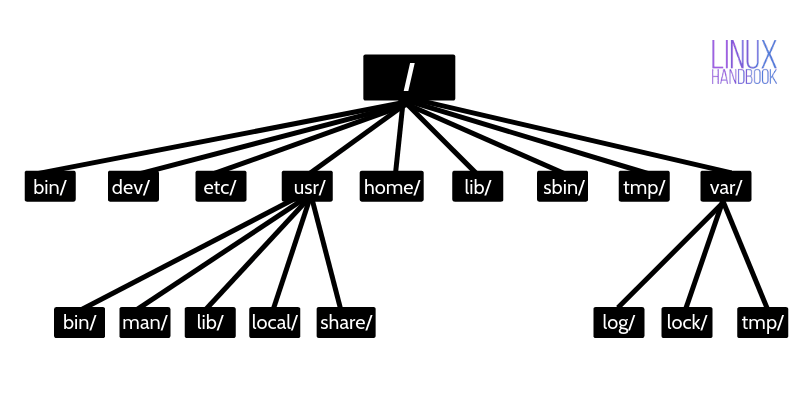

# Basics

### High Level

~~~
User Processes
    GUI, Servers, Shell

Linux Kernel
    System Calls, Process Management, Memory Management, Device Drivers

Hardware
    CPU, RAM, Disks, Network Ports
~~~

* **Kernel**
  * The kernel is in charge of managing tasks in 4 ares:
    * Process
      * Determine which process to run on CPU
    * Memory
      * Keep track of all memory - what is currently allocated to a particular process, what might be shared between processes, and what is free
      * 
    * Device drivers
      * Acts as an interface between hardware and processes
    * Sys calls and supports
      * Processes normally use sys calls to communicate with kernel

* **User Space**
  * The main memory that the kernel allocates for user process is called user space.

---

### Linux Directory Structure

* `/`: root dir

* `/bin`: essential ready-to-run programs(eg. /bin/bash)
* `/usr/bin`: user apps (/usr is read-only)
* `/sbin`: sys administration binaries
* `/lib`: essential shared libs needed by essential binaries in /bin and /sbin
* `/usr/lib`: libs needed by /usr/bin
* `/boot`: static boot files used by the bootloader(eg. kernel program)
* `/opt`: optional add-on packages (eg. homebrew)

* `/etc`: system-wide config files

* `/var`: writable counterpart to /usr(eg. log files would normally be written to /var/log)

* `/proc`: kernel & running process files(only exist in memory)
* `/run`: runtime state files
* `/srv`: data for services provided by the system

* `/dev`: device files (eg. disk, keyboard)
* `/mnt`: temporary mount points
* `/media`: contains subdirectories where removable media devices insert into the computer are mounted.

* `/lost+found`: recovered files
* `/tmp`: temporary files (delete whenever your system is restarted)

* `/home`: home folder for each user(eg. /home/alex)
* `/root`: home directory for the root user(not located at /home/root)

---

### Shell input / output redirection
* `command > file_1`
  * To send the stdout of command to file_1; if file_1 exists, erasing the original file first.
* `command >> file_1`
  * To append the stdout of command to file_1.
* `command_1 | command_2`
  * To send stdout of command_1 to the stdin of command_2.
* `command > file_1 2> file_2`
  * To send stdout of command to file_1, send stderr of command to file_2.
  * 2 here is the stream id of stderr. The stream id of stdout is 1. 
* `command > file_1 2>&1`
  * To send stdout and stderr of command to file_1.
* `command &`
  * Run command in background mode.

---

### Devices
* device files
  * devices are usually accessible as device files (under /dev). (Not all device has device files)

* sysfs
  * To provide a uniform view for attached devices based on their actual hardware attributes, the Linux kernel offers sysfs interface. 
  * in /sys/devices

* `dd`
  * is a useful command to read from an input file or stream, and write to a file or stream.
  * eg. `dd if=/dev/zero of=new_file bs=1024 count=1 skip=2`
    * if: input file
    * of: output file
    * bs: block size to read & write each time
      * ibs, obs
    * count: # of blocks to read
    * skip: skip first n blocks

### Disk & File system

* relationship
  * disk (physical device) -> 1+ partitions (continuous blocks on a disk) -> 1+ volume <-> 1 filesystem

* swap space
  * Not every partition on a disk contains a filesystem. It's also possible to augment the RAM on a machine with disk space. 
  * The disk space used to store memory pages is called swap space. 
  * use `free` to see current swap usage. 

* soft link & hard link
  * inode: pointer or id of a file on the hard disk
  * soft link: link --> file_node
    * link will be removed if file is removed or renamed
    * `ln -s`
  * hard link: link --> inode
    * deleting, renaming or moving the original file will not affect the hard link
    * `ln`

* file system commands
  * `ls -l`
  ~~~
  Type         #of links  owner group   size  mon  day  year  name
  drwxr-xr-x.  2          root  root    6     Aug  9    2021  /var/log
  -rwxrwxrwx.  1          root  root    11    Mar  2    2022  file_1.txt
  lrwxrwxrwx.  1          root  root    10    Aug  9    2021  mail -> spool/mail
  ~~~
  file types:
  ~~~
  symbol    type
  -         regular file
  d         directory
  l         link
  c         character device file
  s         socket
  p         named pipe
  b         block device
  
  * b: block (eg. disk)
      * Kernel accesses data in fixed chunks.
      * total size if fixed.
  * c: character (eg. printer)
    * Kernel reads/writes data streams.
    * don't have a size.
  * p: pipe
    * like a character device, but at the other end is I/O stream instead of a driver.
  * s: socket
    * usually used for inter-process communication.
    * often found outside /dev.
  ~~~

  * copy file/dir
    * file: `cp <src_file> <dest_file>`
    * dir: `cp -R <src_dir> <dest_dir>` (-R means recursively)

  * find file/dir
    * find: `find / -name "ifcfg-eth1"`
    * locate: `locate "ifcfg-eth1"`
    * diff
      * locate uses a prebuilt database, which should be regularly updated;(faster & inaccurate) while find iterates over a filesystem. (slower & accurate)
      * to update locate database, run updatedb
  